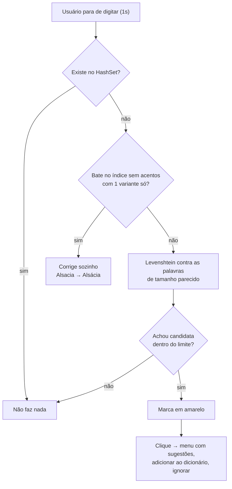

# Editor de Texto com Autocorreção

Trabalho de Algoritmos e Estruturas de Dados — editor de texto em C# / WPF (.NET Framework 4.7.2)
com verificação ortográfica sobre um dicionário de **261.494 palavras** do português.

---

## 1. O que o programa faz

| Situação | Comportamento |
|---|---|
| Palavra existe no dicionário | Nada acontece |
| Falta só acento (`Alsacia`, `voce`, `acucar`) | Corrigido automaticamente → `Alsácia`, `você`, `açúcar` |
| Erro maior (`caza`, `computadr`) | Palavra fica **marcada em amarelo**; o usuário clica e escolhe a correção |
| Palavra desconhecida sem nada parecido | Fica como está |

A verificação roda **1 segundo depois que o usuário para de digitar**, e só nos parágrafos
que mudaram — nunca no caminho da tecla.

---

## 2. O problema central

> Dada uma palavra digitada errada, encontrar as palavras mais parecidas
> entre **261.494** candidatas, rápido o bastante para não travar a digitação.

Duas perguntas diferentes, com soluções diferentes:

1. **"Esta palavra existe?"** — precisa ser instantânea, roda para toda palavra digitada.
2. **"Quais palavras se parecem com esta?"** — só roda quando a primeira pergunta dá "não".

---

## 3. Estruturas de dados

Todas montadas uma única vez, na carga do dicionário (`AutocorrectEngine.LoadDictionary`).

### 3.1 Tabela hash — busca exata

```csharp
private static readonly HashSet<string> Words = new HashSet<string>(StringComparer.Ordinal);
```

Responde "esta palavra existe?" em **O(1)** médio, por hash da string.
É o filtro que evita todo o resto do trabalho: a maioria esmagadora das palavras digitadas
está correta e para por aqui.

Alternativa descartada: `List.Contains` faria busca linear, **O(n)** = 261 mil comparações
por palavra digitada.

### 3.2 Índice por tamanho — poda de candidatos

```csharp
private static readonly Dictionary<int, List<string>> WordsByLength;
```

Usa uma propriedade da distância de edição: transformar uma palavra de tamanho `n` em outra
de tamanho `m` custa **no mínimo** `|n − m|` operações. Então, com limite de 2 edições, só
faz sentido comparar com palavras cujo tamanho esteja na faixa `n ± 2`.

Distribuição real do dicionário:

| Tamanho da palavra digitada | Candidatos na faixa ±2 | % do dicionário |
|---:|---:|---:|
| 2 letras | 2.247 | 0,9 % |
| 4 letras | 20.557 | 7,9 % |
| 6 letras | 75.191 | 28,8 % |
| 8 letras | 149.800 | 57,3 % |
| 10 letras | 180.975 | 69,2 % |

O ganho é enorme para palavras curtas e modesto para palavras longas — a maior parte do
dicionário tem entre 8 e 12 letras (média 9,9). Para as longas, quem segura o custo é a poda
descrita no item 4.2.

### 3.3 Índice por forma sem acentos — correção de acentuação

```csharp
private static readonly Dictionary<string, List<string>> WordsByStripped;
```

A chave é a palavra com os acentos removidos (decomposição Unicode NFD, descartando as marcas
de categoria `NonSpacingMark` — isso trata acentos e cedilha):

```
"alsácia" → "alsacia"      "você" → "voce"      "açúcar" → "acucar"
```

Assim `Alsacia` acha `Alsácia` com **uma consulta hash**, sem calcular distância nenhuma.

São 245.119 formas sem acento distintas; 16.201 delas têm mais de uma variante acentuada.
Nesses casos ambíguos o programa **não** corrige sozinho — mostra as opções, porque escolher
por conta seria chute.

---

## 4. O algoritmo de busca: distância de Levenshtein

### 4.1 Definição

A **distância de edição (Levenshtein)** entre duas palavras é o menor número de operações
que transformam uma na outra, usando três operações de custo 1:

- **inserção** — `casa` → `causa`
- **remoção** — `casa` → `asa`
- **substituição** — `casa` → `caza`

Resolvida por **programação dinâmica**. Seja `D[i][j]` a distância entre os `i` primeiros
caracteres de `A` e os `j` primeiros de `B`:

```
D[i][0] = i
D[0][j] = j

D[i][j] = min( D[i-1][j]   + 1,          remoção
               D[i][j-1]   + 1,          inserção
               D[i-1][j-1] + custo )     substituição (custo 0 se A[i]==B[j], senão 1)
```

A resposta é `D[n][m]`.

### 4.2 Exemplo passo a passo — `casa` × `caza`

```
         ""   c    a    z    a
   ""     0    1    2    3    4
    c     1    0    1    2    3
    a     2    1    0    1    2
    s     3    2    1    1    2
    a     4    3    2    2  ► 1 ◄
```

Distância **1**: basta substituir `s` por `z`. Cada célula olha só três vizinhas
(acima, à esquerda, diagonal), por isso a tabela é preenchida linha a linha.

Implementação em `AED2/SpellChecker.cs:7` (`GetEditDistance`), matriz `(n+1) × (m+1)`.

### 4.3 Custo e as otimizações aplicadas

Versão ingênua: comparar a palavra digitada com todas as 261 mil, cada comparação custando
`O(n × m)`. Com palavras de ~9 letras: **261.494 × 81 ≈ 21 milhões de operações** por palavra
errada — e isso segurando a interface.

Quatro otimizações resolvem, todas em `GetEditDistanceWithin` (`AED2/SpellChecker.cs:32`)
e nos laços de `AutocorrectEngine`:

**a) Duas linhas em vez da matriz inteira**
Cada célula só depende da linha anterior. Guardando duas linhas, a memória cai de
`O(n × m)` para `O(m)` — de uma matriz 9×9 por comparação para dois vetores.

**b) Corte antecipado por limite**
Se **toda** a linha atual já passou do limite de edições aceito, nenhuma linha seguinte
pode melhorar (os valores só crescem para baixo). Aborta ali:

```csharp
if (rowMin > maxDistance) return maxDistance + 1;
```

Na prática, palavras muito diferentes morrem depois de 1 ou 2 linhas, não das 9.

**c) Corte por diferença de tamanho**
Antes de qualquer cálculo:

```csharp
if (Math.Abs(source.Length - target.Length) > maxDistance) return maxDistance + 1;
```

**d) Limite que aperta durante a busca**
Achou uma candidata a distância 1? O limite passa a ser 0 para as próximas — quase todas
morrem na primeira linha. E se aparece distância 1, a busca encerra (0 seria correspondência
exata, já testada pela tabela hash).

### 4.4 Limite adaptativo por tamanho

Distância 2 numa palavra de 2 letras troca a palavra inteira e casa com lixo
(`vc` → `ac, bc, vá, vã, vê, vi`...). Por isso:

| Tamanho da palavra | Edições aceitas |
|---|---|
| até 3 letras | 1 |
| 4 ou mais | 2 |

---

## 5. Fluxo completo de uma palavra digitada



---

## 6. Desempenho medido

Máquina de teste, dicionário completo carregado.

**Carga e busca**

| Operação | Tempo |
|---|---|
| Carregar 261.494 palavras e montar os 3 índices | 419 ms (uma vez, ao abrir o programa) |
| Palavra correta — só a tabela hash | 0,002 ms |
| Correção de acento (`voce` → `você`) | 0,004 ms |
| Palavra errada com sugestão (`computadr`) | 1,2 ms |
| Pior caso: palavra de 9 letras sem nenhuma sugestão (`xyzqwkjhg`) | 81 ms |

O pior caso é justamente quando **não existe** sugestão: nenhuma candidata entra dentro do
limite, então nada aperta o corte e a busca precisa percorrer todos os candidatos de tamanho
parecido — 9 letras caem na faixa mais populosa do dicionário. Quando existe uma correção
boa, o limite cai para 1 logo no começo e a busca termina em cerca de 1 ms, ou seja, **o caso
comum é ~70× mais rápido que o pior caso**.

**Interface**, em documento de 1.500 linhas / 200 mil caracteres:

| Métrica | Antes de otimizar | Depois |
|---|---:|---:|
| Abrir o arquivo | 806 ms | 157 ms |
| Elementos de texto no documento | 36.000 | 1.500 |
| Maior travada da interface | 842 ms | 254 ms |
| Digitação (média / pior tecla) | 1,10 / 5,18 ms | 1,17 / 2,65 ms |

O gargalo da interface não era o algoritmo de busca — era o `RichTextBox` recebendo um
elemento de texto separado por palavra. Juntar os trechos sem marcação em um elemento só
resolveu.

**Exemplo real de saída**

```
digitado:  e  k  eh  vc  ate  sao  voce  ja  la  caza  Alsacia

  e                    normal      palavra válida
  k                    AMARELO
  eh                   AMARELO
  vc                   AMARELO
  ate são você já la   normal      acentos corrigidos sozinhos
  caza                 AMARELO
  Alsácia              normal

sugestões para "computadr": computada, computado, computador, computar, computa
```

---

## 7. Organização do código

| Arquivo | Responsabilidade |
|---|---|
| `AED2/SpellChecker.cs` | Distância de Levenshtein: versão completa e versão podada |
| `AED2/AutocorrectEngine.cs` | Dicionário, os três índices, correção e sugestões |
| `AED2/SpellCheckHighlighter.cs` | Ligação com a interface: marcação amarela, menu de sugestões, temporizador de ociosidade |
| `AED2/MainWindow.xaml(.cs)` | Janela, abrir e salvar arquivo |
| `AED2/Palvras em Portugues.txt` | Dicionário, uma palavra por linha |

### Principais métodos públicos

```csharp
// SpellChecker
int  GetEditDistance(string a, string b)                        // matriz completa
int  GetEditDistanceWithin(string a, string b, int maxDistance) // duas linhas + corte

// AutocorrectEngine
int         LoadDictionary(string caminho)
bool        IsKnown(string palavra)                    // tabela hash, O(1)
bool        TryFixAccents(string p, out string saida)  // índice sem acentos, O(1)
bool        HasSuggestion(string p, int max)           // para na primeira encontrada
string      Correct(string p, int max)                 // melhor correção
List<string> Suggest(string p, int max, int qtd)       // lista ordenada por distância
```

---

## 8. Detalhes de implementação que valem menção

- **Capitalização preservada**: `ABACAXII` → `ABACAXI`, `Brazil` → `Brasil`.
- **Cache de decisões**: cada palavra já avaliada guarda o resultado; texto com repetição
  não paga duas vezes.
- **Ambiguidade não é corrigida sozinha**: `caza` fica a distância 1 de `casa`, `cara`, `caça`
  e `cada`. Sem informação de frequência de uso, escolher seria chute — por isso a decisão
  fica com o usuário, no menu.
- **Verificação por parágrafo**: só os parágrafos alterados entram na fila, inclusive no caso
  de colar várias linhas de uma vez.

---

## 9. O que daria para melhorar

| Limitação atual | Caminho |
|---|---|
| Sugestões sem ordem de relevância entre distâncias iguais | Dicionário com frequência de uso das palavras |
| Busca varre todos os candidatos de tamanho parecido | Índice de deleções (SymSpell) ou árvore BK, que trocam memória por velocidade |
| Acento conta como edição (`programacaoo` não acha `programação`) | Calcular a distância também sobre a forma sem acentos |
| `FlowDocument` não virtualiza; arquivo muito grande pesa | Voltar ao `TextBox` simples e desenhar as marcas por cima |
